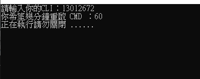

# 功能介紹

此腳本的功能如下：

- 執行後，使用者需輸入 `cli` 路徑與 `nexus-network` 路徑。
- 腳本將透過 CLI 自動執行 `nexus Contribute via CLI`。
- 為避免命令提示字元（CMD）卡住，每隔 5 分鐘會自動關閉舊的 CMD 視窗，並啟動新的 CMD 來重新執行任務，確保任務穩定執行不中斷。

# Nexus Network 安裝指南

> ⚠️ **注意：請先安裝好以下工具：**
> 
> - [WSL (Windows Subsystem for Linux)](https://learn.microsoft.com/zh-tw/windows/wsl/install)
> - `curl` 指令（大多數系統已內建）

---

## 1. 安裝 CLI 工具

```bash
curl https://cli.nexus.xyz/ 
```

## 2. 使用流程

1.下載 Releases 最新版 .exe 檔   
2.到網站找你得 7 位數密碼: `https://app.nexus.xyz/nodes`  
3.輸入 CLI     
4.輸入 wsl 中 nexus-network 路徑 which (不知道的話請在 wsl 輸入 which 
nexus-network)  


